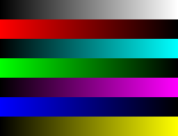
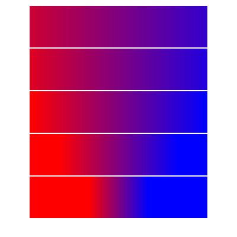

An engine for producing 2D graphics as produced over the course of the semester in my university graphics course. All code
with the `Fed` prefix is mine, while everything else was provided by the instructor. Features of the engine include:

  * Blending 
  * Shading
  * Clipping
  * Bitmaps
  * Transformations
  * Convex Polygons
  * Gradients
  * Stroking (opaque colors only)

To buld, test, and produce sample images, use

    $ make
    $ ./tests
    $ ./image -e expected

(Requires `libpng` to build)

Sample images created with the engine are shown below:

 

 

